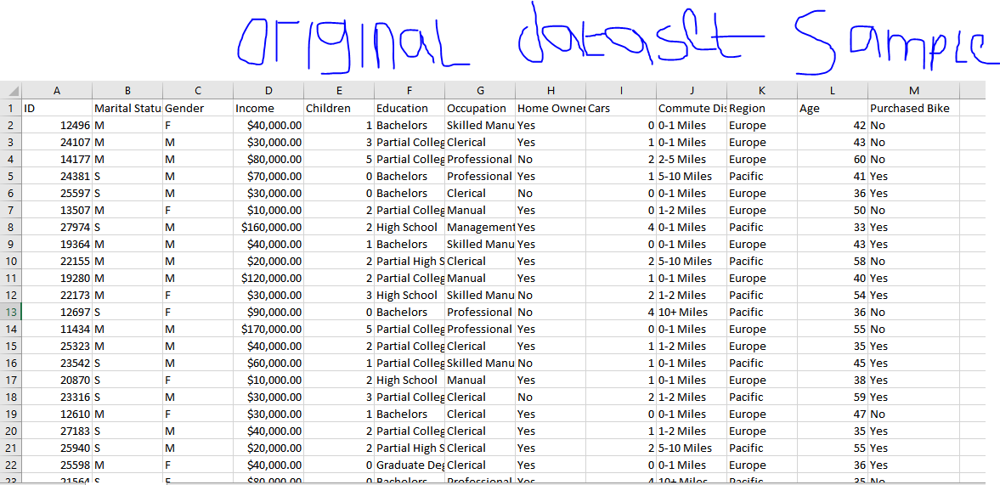
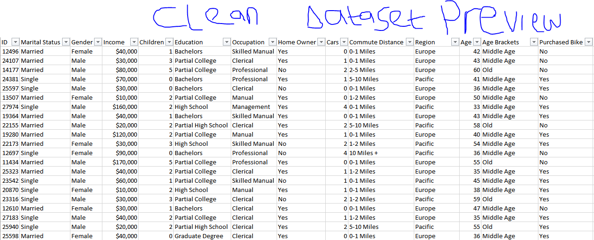
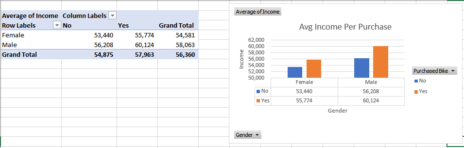
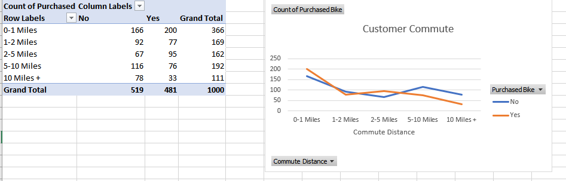
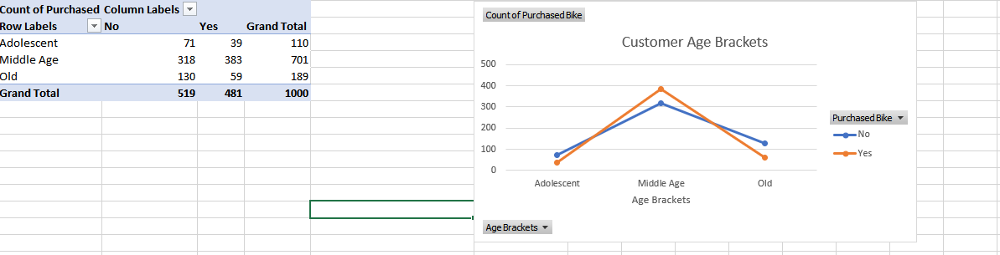
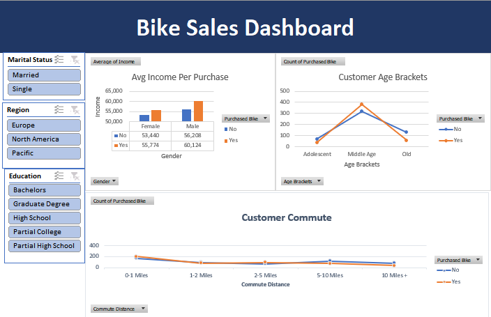

# Bike_buyers_Analysis
This project analyzes a dataset of bike buyers using Microsoft Excel to uncover trends and visualize key insights. It includes steps for data cleaning, creating pivot tables, and building an interactive dashboard. The analysis explores relationships between demographics, income,  and bike purchases, offering actionable insights for businesses.
  

# Dataset Overview: 
The original dataset had 1,027 rows and 13 columns. After identifying and removing 26 duplicate records, the cleaned dataset had 1,001 rows and 13 columns.
       

# Steps and Process
## 1. Data Cleaning & Transformation
Before diving into analysis, I ensured the dataset was clean and meaningful:
Duplicate Removal: Identified and removed 26 duplicate rows.

  

# Column Standardization:

Marital Status: Replaced abbreviations (e.g., "M" → "Married").

Gender: Standardized values (e.g., "F" → "Female").

Income: Converted to currency format and rounded values.

New Columns: Created an Age Brackets column (Adolescent, Middle Age, Old) using logical formulas.

# Step 2
## Data Analysis with Pivot Tables

I created pivot tables to explore key relationships:

Average Income Per Purchase: Segmented by gender and bike purchase status.

  

Customer Commute Distance: Analyzed bike ownership across commute lengths.

  

Age Brackets Analysis: Examined purchase trends by age group

  

# Step 3
## Dashboard Design

I built an interactive dashboard featuring:

Slicers: For filtering by Marital Status, Region, and Education Level.

Visualizations:

Bar charts for income and gender breakdowns.

Line graphs for commute distances.

Age brackets analysis.

## Here’s a snapshot of the dashboard:

# Key Insights

1. Middle-aged buyers dominate bike purchases.

2. Higher education levels and income correlate with higher bike ownership.

3. Customers commuting longer distances are more likely to purchase bikes.

# Lessons Learned

Excel’s Pivot Tables and Slicers are powerful tools for data exploration and visualization.

Proper data cleaning transforms raw datasets into meaningful, actionable insights.

Well-designed dashboards enhance data storytelling and decision-making.

